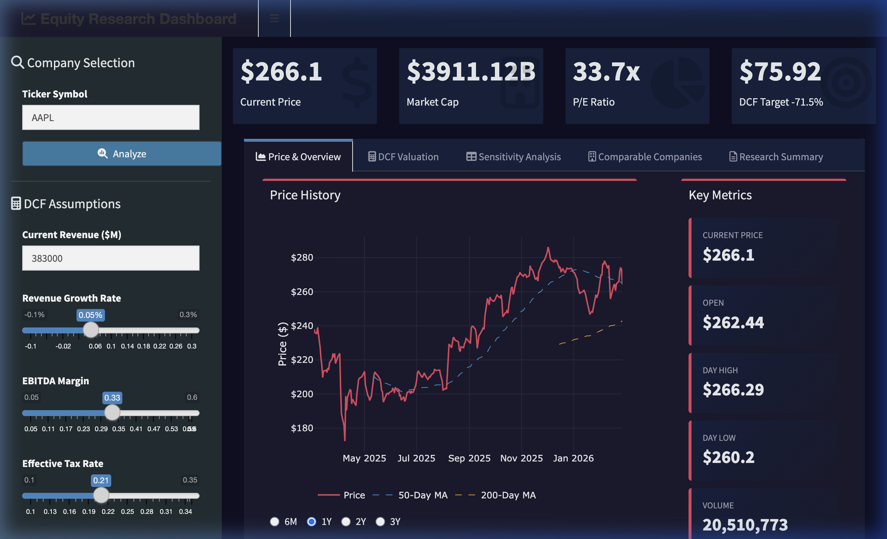

# Drew Galvin | Financial Analysis & Fintech Portfolio
[LinkedIn](https://www.linkedin.com/in/drew-galvin/) | [Live Project](https://drewgal-ncsu.shinyapps.io/equity-research/) | [GitHub](https://github.com/drewgal-ncsu)

## Professional Summary
Entry-level Financial Analyst with a focus on Fintech and Quantitative Analysis. Graduating from NC State University in May 2026. Proven capability in bridging capital markets theory with full-stack development, specializing in automating research workflows and developing interactive valuation engines using R/Shiny.

---

## Projects & Experience

### Equity Research & Valuation Dashboard
*Full-Stack Financial Application | R, Shiny, Quantmod, Plotly*

[**Launch Live Dashboard**](https://drewgal-ncsu.shinyapps.io/equity-research/)

#### Interface Preview

#### Video walkthrough

**Analytical Framework & Business Impact:**

| Feature | Technical Implementation | Business Impact |
|:---|:---|:---|
| **Dynamic DCF Modeling** | 5-Year Gordon Growth / Terminal Value models | Enables instant "What-If" analysis for intrinsic value calculations |
| **Live Market Data** | Real-time ingestion via quantmod and Yahoo Finance APIs | Eliminates manual entry errors and ensures analysis uses latest pricing |
| **Sensitivity Modeling** | Multi-variable heatmap (WACC vs. Terminal Growth) | Visualizes valuation risk and potential margin of safety across macro scenarios |
| **Automated Summaries** | Rule-based recommendation engine (Buy/Hold/Sell) | Streamlines research-to-report pipeline by generating standardized memos |
| **Comparable Analysis** | Peer benchmarking against P/E and Market Cap metrics | Provides relative valuation context alongside intrinsic value analysis |

**Key Achievements:**
*   **Fundamental Valuation Engine:** Engineered a robust DCF engine to calculate intrinsic share value based on user-defined growth and margin assumptions.
*   **Automated Data Ingestion:** Developed a real-time data pipeline leveraging the quantmod API to ingest live market quotes and financial metadata.
*   **Advanced Risk Modeling:** Implemented a dynamic sensitivity analysis heatmap to visualize valuation risk—a critical tool for assessing "Margin of Safety."

### Portfolio Risk Analyzer (Deploying Soon)
*Risk Management Tool | R, Shiny, PerformanceAnalytics, quantmod, MASS*

Multi-asset portfolio construction tool with Monte Carlo simulation, Value at Risk, and historical stress testing. The companion to the Equity Research Dashboard — one analyzes individual securities, this one manages risk across a portfolio.

**Core Capabilities:**
*   **Custom Portfolio Construction:** Build portfolios with up to 6 assets, benchmarked against SPY/VTI/QQQ.
*   **Risk Metrics (VaR):** Three methods of Value at Risk: parametric, historical, and Conditional VaR (Expected Shortfall).
*   **Monte Carlo Simulation:** 5,000+ correlated return simulations using the multivariate normal distribution.
*   **Stress Testing:** Historical simulation against 6 real market crashes including COVID, GFC, and the 2022 rate shock.
*   **Performance Attribution:** Full metrics including Sharpe, Sortino, Beta, Alpha, max drawdown, and Calmar ratio.

---

## What Each Project Signals

| Project | Interview Conversation |
|:---|:---|
| **Equity Research Dashboard** | "I can analyze and value individual securities" |
| **Portfolio Risk Analyzer** | "I understand how securities interact in a portfolio and how to manage risk" |
| **Earnings Surprise Tracker** | "I can find patterns in event-driven data" |
| **Factor Screener** | "I understand quantitative strategies and backtesting discipline" |
| **Macro Dashboard** | "I can put markets in the context of the broader economy" |

---

## On the Roadmap

| Project | What It Demonstrates |
|:---|:---|
| **Earnings Surprise Tracker** | Event-driven analysis — measuring stock reactions to earnings beats/misses by sector |
| **Factor Screener & Backtester** | Quantitative strategy — scoring stocks on value/momentum/quality and backtesting |
| **Macro Regime Dashboard** | Economic analysis — tracking Fed rates, yield curve, CPI, and recession indicators via FRED |
| **Options Pricing & Greeks** | Derivatives knowledge — interactive Black-Scholes with 3D Greeks surface plots |

---

## Technical Skillset

**Financial Analysis:**
DCF modeling, comparable company analysis, sensitivity analysis, portfolio construction, risk metrics (VaR, Sharpe, Sortino, Beta), Monte Carlo simulation, technical analysis.

**Programming & Data:**
R (Shiny, quantmod, PerformanceAnalytics, dplyr, Plotly), Git/GitHub, SQL fundamentals, RMarkdown, financial data APIs (Yahoo Finance, FRED).

**Tools:**
RStudio, Google Antigravity IDE, shinyapps.io deployment.

---

## About Me
I am graduating from NC State University in May 2026 with a focus in finance and a strong interest in where financial analysis meets technology. I built these projects because I believe the best way to demonstrate analytical skill is to show it working — live, with real data, producing real output.

Every project here is designed to spark the kind of technical conversation that belongs in a finance interview. If you're a recruiter or hiring manager, I'd welcome the chance to walk you through any of them.

**Future Research Directions:**
What I'd build next given more time: A WACC calculator with CAPM-based cost of equity estimation, and a Monte Carlo simulation that incorporates regime-switching rather than assuming stationary returns — because markets don't behave the same in bull runs and recessions.

---

*Technical Note: This repository is intended to demonstrate technical and analytical competency. All calculations and recommendations are based on user-input assumptions and do not constitute financial advice.*
